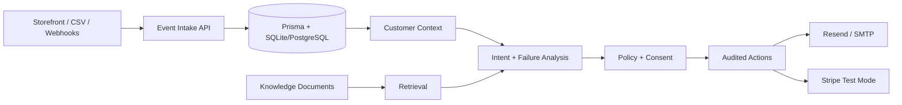

# INTENTLOOP

Agentic customer acquisition, knowledge retrieval, conversion, and retention platform.

## Local setup

Requirements: Node.js 20+ and npm.

```powershell
Copy-Item .env.example .env
npm install
npm run db:push
npm run seed:demo       # optional: clearly labeled synthetic data
npm run dev
```

Open http://localhost:3000. Without provider credentials, email, Stripe, and AI actions remain unavailable rather than reporting fake success. Reset the local database with `npm run reset:demo`.

## Environment

See [.env.example](.env.example) for all required variables. Secrets are read only from the environment and are never stored in Prisma.

## API

Implemented routes: `GET /api/dashboard`, `GET /api/customers?search=&stage=`, `POST /api/events`, and `GET /api/integrations/health`.

## Architecture



## Current status

The foundation includes the core schema, opt-in synthetic demo factory, database-backed overview, responsive terminal UI, validated event ingestion, customer search, and explicit provider health checks. Remaining work includes auth, customer 360, CRUD/import APIs, RAG embeddings, provider execution, approvals, and automated coverage.

## Checks

```powershell
npm run build
npm run lint
```
